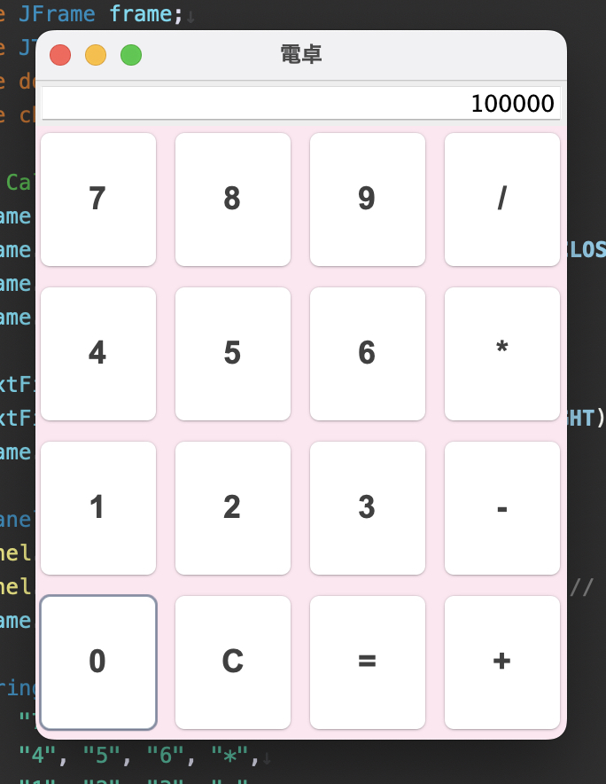

# calculator-swing
初めてのJava簡易電卓アプリ（初学習のため参考コードを元に作成）

このアプリは、基本的な四則演算（足し算、引き算、掛け算、割り算）を行うシンプルな電卓アプリです。 
Swingを使用して、パステルカラーのかわいい電卓（GUI）を実装。 初アプリ開発のためほぼコードは参考を元にしています。

主な機能

- 足し算
- 引き算
- 掛け算
- 割り算

使い方

1. EclipseやVS CodeなどのIDEでプロジェクトを開きます。
2. Calculator.java を実行して電卓を起動します。
3. GUI上で数式を入力して計算結果を得ることができます。

必要な環境
- EclipseやVS CodeなどのIDE
- Swing（Java標準ライブラリ）
